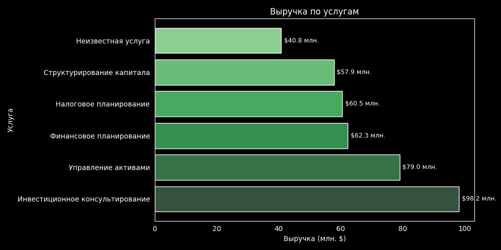
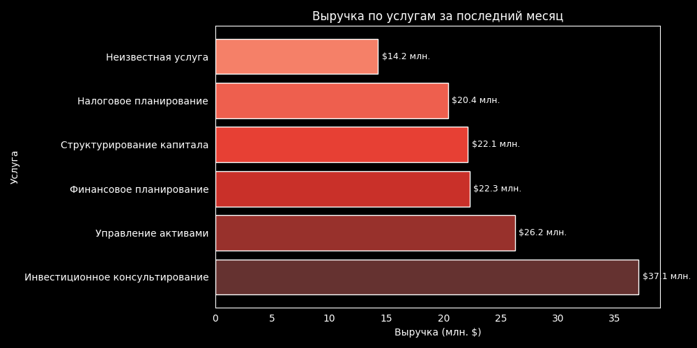
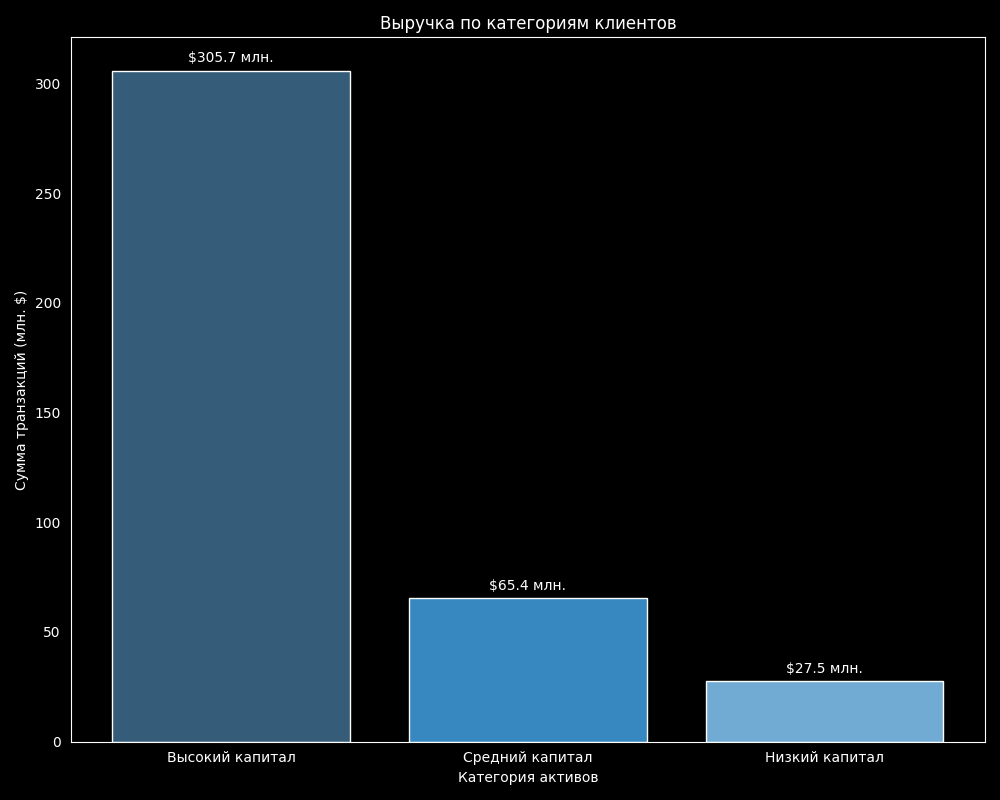
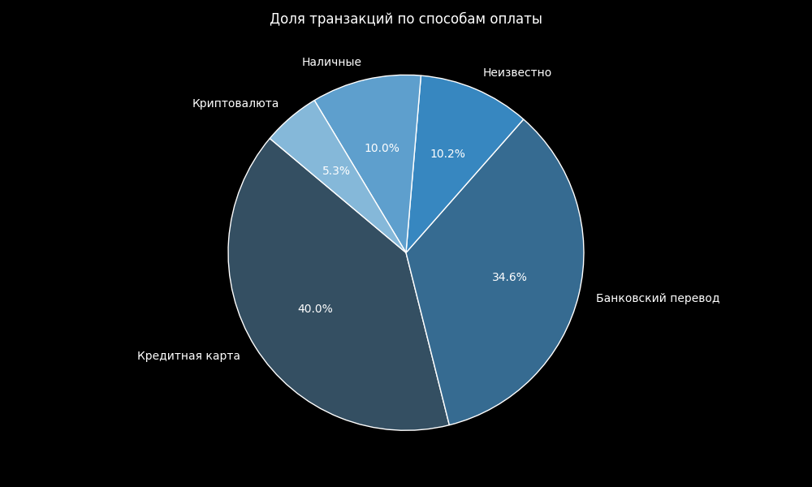
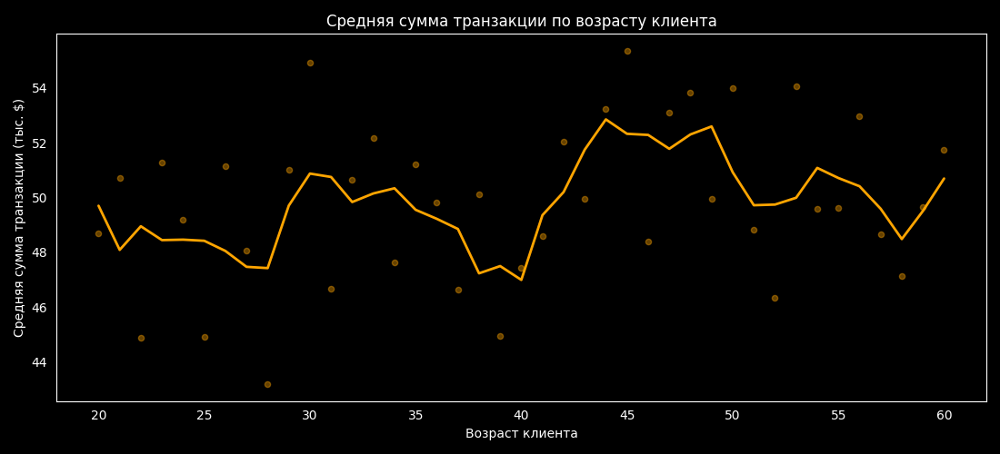
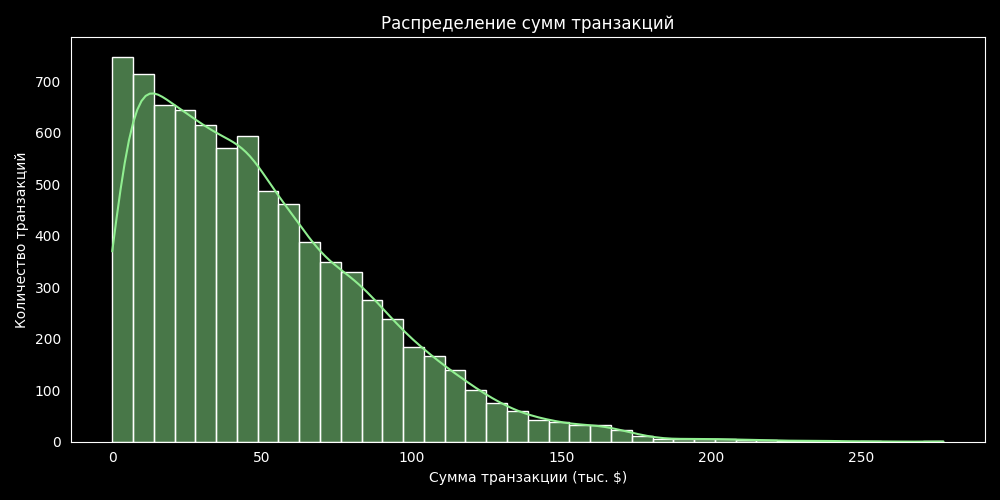
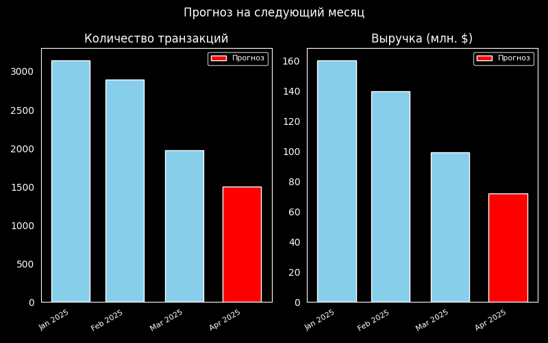

# Анализ финансовых транзакций
22.02.2026 08:40

## Топ-5 услуг по количеству транзакций
| service                         | count   |
|:--------------------------------|:--------|
| Инвестиционное консультирование | 1,956   |
| Управление активами             | 1,607   |
| Финансовое планирование         | 1,242   |
| Налоговое планирование          | 1,218   |
| Структурирование капитала       | 1,196   |

## Услуга с наибольшей выручкой
| service                         | amount      |
|:--------------------------------|:------------|
| Инвестиционное консультирование | $98,211,882 |

## Выручка по услугам

Общая выручка за последний месяц: $142,371,459

## Топ-5 средних сумм транзакций по городам
| city               | amount   |
|:-------------------|:---------|
| Michellehaven      | $58,332  |
| East Rachelmouth   | $57,473  |
| Port Michellemouth | $57,147  |
| New Tommyborough   | $54,873  |
| North Lauriebury   | $54,053  |

## Выручка по категориям клиентов

## Доля транзакций по способам оплаты

## Средняя сумма транзакции по возрасту клиента

## Распределение сумм транзакций

## Прогноз на следующий месяц
Прогноз количества транзакций: 1504

Прогноз выручки: $71,823,197

